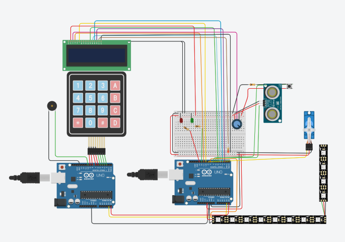
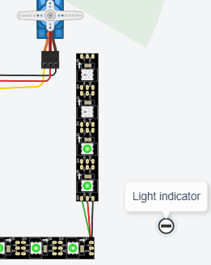
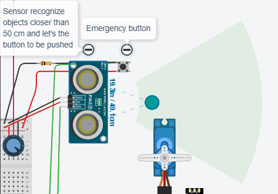

 

  

  <h3 align="center">Tinkercad Project</h3>

    Open door with keypad, sensor and timer
     
    KYH
     

  

  
<h2 style="display: inline-block">Lab Details</h2>

  <ol>
    <li><a href="#devices-used">Devices used</a>
    <li><a href="#lab-description">Lab description</a></li>
    </li>
    <li><a href="#lab-date">Lab date</a></li>
    <li><a href="#prerequisites">Prerequisites</a></li>    
    <li><a href="#lab-steps">Lab steps</a></li>
    <li><a href="#lab-files">Lab files</a></li>
    <li><a href="#link">Link</a></li>
  </ol>

---

## Devices used
* Arduino UNO X 2

* NeoPixel Strip

* Micro Servo

* Keypad 4x4

* LCD 16x2

* Ultrasonic Distance Sensor

* Buzzer

---

## Lab description

Door opening system with pin 2589. The "door" closes automatically
after 5 seconds. You can reopen the door by providing the * + code again. Led Strip indicates when it's ok to walk in. LCD displays the door's status and countdown. There's an emergency button for those "inside" to open the door but only if the object is closer than 50 cm to Ultrasonic Distance Sensor (PING). Keyboard beeps with different tones depending on the value. The NeoPixel Strip flashes in two colors depending on if the door is open and "leads the way" when it is.

---

### Lab date
15-10-2021

---

### Prerequisites
* Tinkercad
* some C programming knowledge

---

### Lab steps
1. Open the Micro Servo with code 2589. NeoPixel Strip will indicate that door is open:

   

    It'll automatically close after 5 seconds. 

2. LCD will display count down. 
3. When servo is in closed position you may open door with "Emergency button" but only if an object is within 50 cm range from Ultrasonic Distance Sensor.
  

---
### Lab files

* [arduino1.c](arduino1.c)
* [arduino2.c](arduino2.c)

---

### Link

* [Tinkercad Project](https://www.tinkercad.com/things/aNbHGKPU3i8-start-simulating/editel?lessonid=EHD2303J3YPUS5Z&projectid=OIYJ88OJ3OPN3EA&collectionid=OIYJ88OJ3OPN3EA&sharecode=S8ua2dWpXFmmlE4zHoEfHEHs6UHi-dzMfuHC3JdVOgk)

